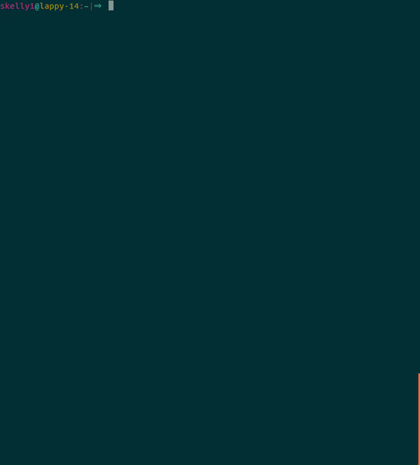

# SoftSysBombassticBamboo
Olin College of Engineering - Software Systems Final Project

## Install

**Ncurses**

Ubuntu: `sudo apt-get install libncurses5-dev`

Mac: `brew install homebrew/dupes/ncurses`

## Quickstart

Clone our repo.

`git clone https://github.com/thecardkid/terminally-tetris.git`

Build our game.

`make`

Change directory to the executable binary file.

`cd build`

Run Tetris in the terminal!

`./ttetris`
